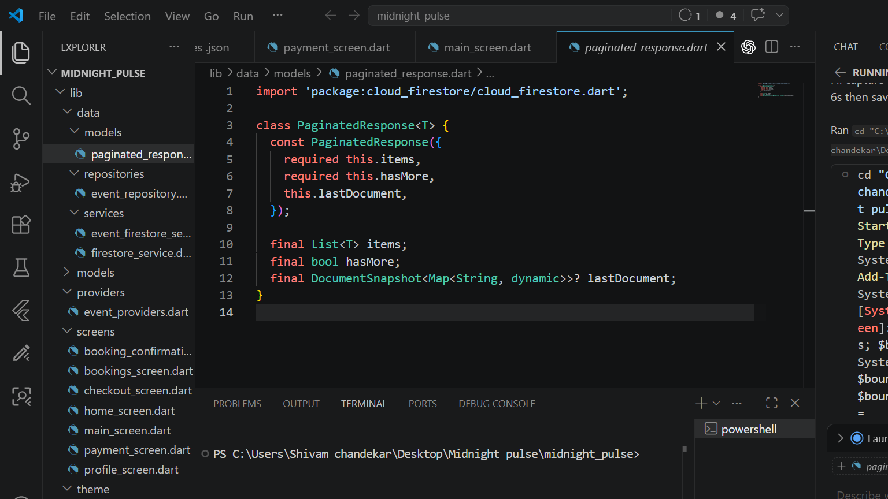

# 🎵 Midnight Pulse

**Midnight Pulse** is a premium Flutter application designed for discovering exclusive events, booking concert tickets, and managing digital event access. Built with a focus on modern UI/UX, seamless payment integration, and a robust cloud backend, this app provides a complete end-to-end event discovery and booking experience.

<p align="center">
  
</p>

## 🚀 Key Features

* **Event Discovery & Booking**: Browse upcoming concerts, view real-time seat availability, and book tickets instantly.
* **Authentication & Profiles**: Secure user sign-ups, logins, and personalized user profiles.
* **Digital QR Tickets**: Instant generation of scannable QR code tickets for event entry.
* **Seamless Payments**: Integrated secure payment gateway supporting UPI, Credit/Debit Cards, NetBanking, and Wallets.
* **Midnight Pass Membership**: A premium subscription tier offering priority entry, early ticket access, and exclusive discounts.
* **Saved Lineup**: Interactive event saving (double-tap) to build a personalized lineup for quick access.
* **Push Notifications**: Real-time reminders for upcoming events, bookings, and special ticket drops.
* **Reviews & Ratings**: Post-event rating and review system.
* **Admin Capabilities**: Backend logic and roles for managing events, reviewing bookings, and triggering notifications.

## 🛠️ Tech Stack & Tools

### **Frontend & Architecture**
* **Flutter & Dart**: Cross-platform framework for a high-performance, native-like mobile experience.
* **Riverpod**: Scalable, compile-safe state management across the application.
* **Custom UI Components**: Built-in Lottie animations, skeleton loading (Shimmer), and responsive Material designs.

### **Backend as a Service (Firebase)**
* **Firebase Authentication**: Seamless user identity management.
* **Cloud Firestore**: Real-time NoSQL database handling events, user profiles, bookings, and reviews with strict Security Rules.
* **Firebase Cloud Functions (TypeScript)**: Serverless backend execution for secure payment signature verification and QR data generation.
* **Firebase Cloud Messaging (FCM)**: Handling rich push notifications.
* **Firebase Analytics & Crashlytics**: Tracking app engagement, events, and diagnosing real-time crashes.

### **Third-Party APIs & Libraries**
* **Razorpay SDK (`razorpay_flutter`)**: Production-ready payment processing (focused on Indian payment methods).
* **QR Generation (`qr_flutter`)**: Rendering scannable digital tickets offline.
* **Utilities**: `cached_network_image` (efficient image loading), `share_plus` (event sharing), and `intl` (date/currency formatting).

## 🏗️ Technical Highlights

The application follows a clean architecture designed for maintainability and scalability:
* **Separation of Concerns**: Strict boundary between the UI, State (Riverpod), and Data/Services layer (`UserFirestoreService`, `BookingFirestoreService`).
* **Real-time Data Sync**: Using Firestore streams to automatically update UI states (e.g., live seat availability, live booking status).
* **Secure Transactions**: Ensuring payment integrity by validating transactions server-side using Firebase Cloud Functions before persisting booking data.

For a deeper dive into the screen flows and architecture, check out the [App Architecture Documentation](APP_ARCHITECTURE.md).

## 🏃‍♂️ Getting Started

To run the project locally on your machine:

1. **Clone the repository:**
   ```bash
   git clone https://github.com/your-username/midnight_pulse.git
   ```

2. **Install dependencies:**
   ```bash
   cd midnight_pulse
   flutter pub get
   ```

3. **Configure Firebase & API Keys:**
   * Ensure you have a Firebase project created. Add your `google-services.json` (Android) and `GoogleService-Info.plist` (iOS) in the respective directories.
   * Add your Razorpay API keys in the environment variables.

4. **Run the app:**
   ```bash
   flutter run
   ```

## 💡 Why I Built This

I built **Midnight Pulse** to demonstrate my proficiency in building complete, production-ready mobile applications. This project showcases my ability to:
* Integrate complex cloud infrastructure and serverless functions using Firebase.
* Implement secure user flows, including real payment gateway integrations and digital ticketing.
* Architect scalable Flutter applications using modern state management (Riverpod).
* Design beautiful, responsive, and heavily animated user interfaces that prioritize User Experience (UX).

Feel free to explore the codebase!

---
*Built with ❤️ using Flutter.*
